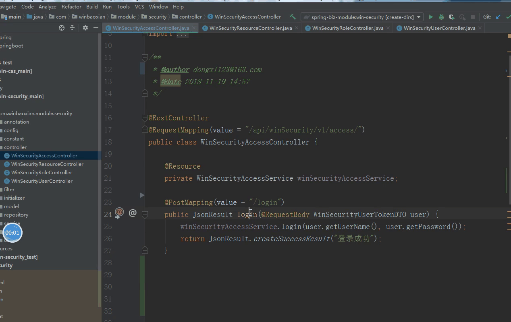
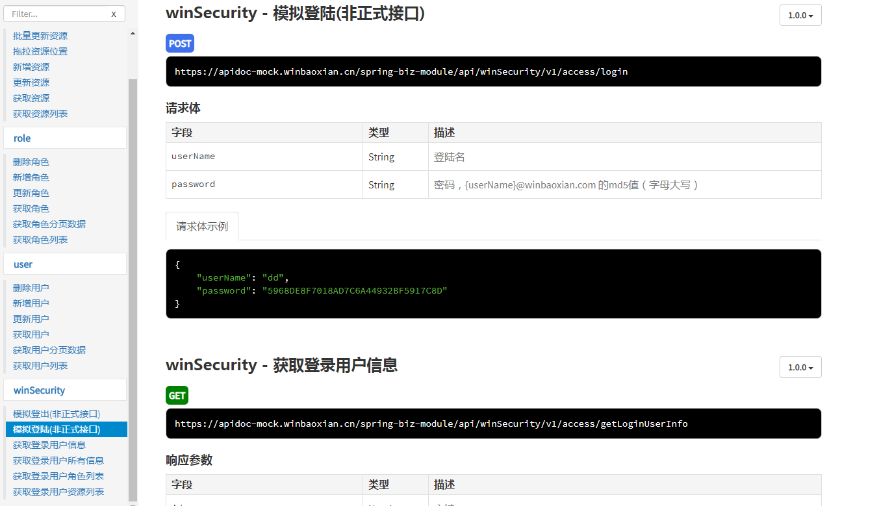

ApiDoc
---

* This is a plugin you can generate apiDoc from request in controller.
* Please do aware **This plugin is only for IntelliJ IDEA**.
* This plugin develop for the npm model `apidoc`, [HomePage](https://www.npmjs.com/package/apidoc), install command `npm i apidoc` 

## Install   
- Using IDE built-in plugin system on Windows:
  - <kbd>File</kbd> > <kbd>Settings</kbd> > <kbd>Plugins</kbd> > <kbd>Browse repositories...</kbd> > <kbd>Search for "ApiDoc"</kbd> > <kbd>Install Plugin</kbd>
- Using IDE built-in plugin system on MacOs:
  - <kbd>Preferences</kbd> > <kbd>Settings</kbd> > <kbd>Plugins</kbd> > <kbd>Browse repositories...</kbd> > <kbd>Search for "ApiDoc"</kbd> > <kbd>Install Plugin</kbd>
- Manually:
  - From official jetbrains store Download the `latest release` and install it manually using <kbd>Preferences</kbd> > <kbd>Plugins</kbd> > <kbd>Install plugin from disk...</kbd>

## Usage
### Use IDE menu

### Use hotkey
Default **Option + Ctrl + Shift + p**(Mac), **Alt + Ctrl + Shift + p** (win)

### Examples
* operation steps

* use npm command `apidoc`, to generate html

## Version Info
v1.8-5
>
* fix bug: request url

v1.8-4
>
* fix bug:  parameter parse error with annotation `@RequestBody` in some cases, like `List<Object>`, `Object[]`
* fix bug: example data generate error when in some cases
* add pluginIcon.svg

v1.8-3
> 
* fix bug:  request parameter parse error with some annotations, like `@Validated`, `@ModelAttribute`

v1.8-2
> 
* fix bug:  generic parameter parse error in some cases

v1.8-1
> 
* fix bug:  request url not support annotation attribute `path`

v1.7
> 
* Optimizing UI Interface : add regenerate example radiobutton

v1.6
> 
* Resolve conflict: JavaDocWriter component name collision

v1.5
> 
* Add ApiDoc Plugin Settings: support set parameter `extract object properties max depth`

v1.4
> 
* Optimizing UI Interface

v1.3
> 
* Support IDEA earlier version since 162+
* bugFix: responseBody field support special psiType, eg. BigInteger, iterable class...
* bugFix: remove Deprecated field 

v1.2
> 
* Optimizing Example Data Generation
* Optimizing UI Interface 

v1.1
> 
* Support Auto Generate Example Data
* Optimizing UI Interface 
* bugFix: field description should support special char `space`

v1.0
> first version
* Support UI operation
* Only Support for public method in Controller with annotation related by httpRequest
* Supports shortcut to open ApiDoc, default option + ctrl + shift + p (mac), alt + ctrl + shift + p(win)
* Support to generate apidoc
* Support to modify the doc with memory feature